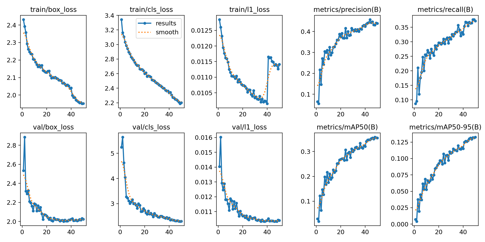
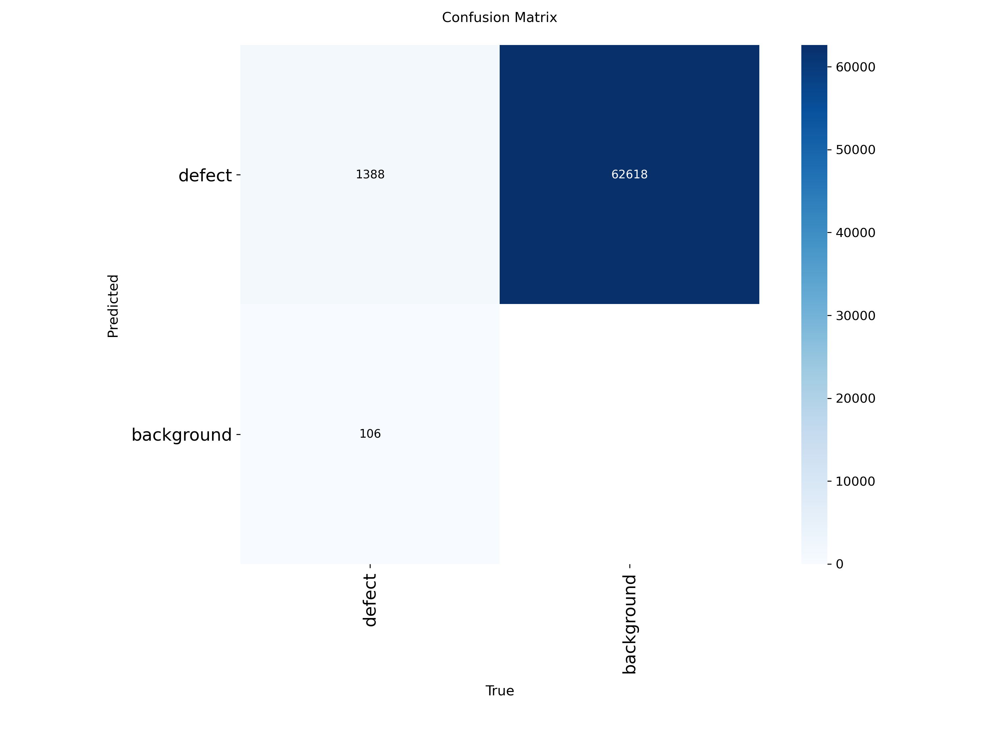

# RailGuard — YOLO26 Railway Defect Detection

> Part of **RailGuard**: *AI-Based Railway Track Fault Detection, Localization, Severity Assessment and Real-Time Monitoring System*

| | |
|---|---|
| **Model** | YOLO26n (Ultralytics) |
| **Task** | Binary railway-defect object detection (1 class: `defect`) |
| **Weights** | `YOLO26_railway_defect_best.pt` (5.14 MiB) |
| **Ultralytics** | 8.4.173 |
| **Dataset** | Railway Track Surface Faults Dataset v2 (Mendeley Data), converted to a single `defect` class |

---

## 1. Overview

This folder contains the complete YOLO26 experiment for RailGuard: dataset conversion, training, validation, test evaluation, prediction outputs and false-positive / false-negative analysis.

The model is an object detector. For each image it predicts:

- whether a railway defect is present,
- where it is (bounding box),
- how confident it is (confidence score).

The original multi-class annotations were collapsed into one class, so the model answers **"Where is a railway defect?"** It does **not** answer **"What type of defect is it?"**, and it does not provide GPS coordinates, track chainage or a validated severity assessment.

| ID | Class |
|---:|---|
| 0 | defect |

## 2. Results at a Glance

Held-out test set: **300 images, 1,494 ground-truth objects**.

| Precision | Recall | F1-score | mAP@50 | mAP@50-95 |
|---:|---:|---:|---:|---:|
| 0.4344 | 0.3762 | 0.4032 | 0.3745 | 0.1363 |

Training time: 0.917 h on a Tesla T4 · Model size: 5.14 MiB.



---

## 3. Dataset

### 3.1 Source

**Railway Track Surface Faults Dataset**, Version 2, published 6 January 2022 on Mendeley Data.

- DOI: [10.17632/8hxtgyyxrw.2](https://data.mendeley.com/datasets/8hxtgyyxrw/2)
- Contributors: Asfar Arain, Sanaullah Mehran, Muhammad Zakir Shaikh, Dileep Kumar, Tanweer Hussain, Bhawani Shankar Chowdhry
- Institution: Mehran University of Engineering and Technology (NCRA Condition Monitoring Systems Lab), Jamshoro, Pakistan
- Data article: <https://www.ncbi.nlm.nih.gov/pmc/articles/PMC10828558/>

**Acquisition.** Video was recorded at 120 FPS by two EKEN-H9R cameras mounted on both sides of a railway inspection vehicle (Pakistan Railway, Kotri Junction). Unnecessary video was removed, frames were extracted, and the frames were labelled manually. The dataset page lists these defect types: Grooves, Joints, Cracks, Flakings, Shellings, Spallings and Squats.

**Working copy.** The experiment used a YOLOv8-format export of this data (`rail defects detection.v18i.yolov8`) stored as a Kaggle dataset, already divided into `train`, `valid` and `test` splits. The exported labels contain class IDs `0`–`9`.

### 3.2 Annotation Format

YOLO detection format, one object per line, coordinates normalised to the image size:

```text
class_id x_center y_center width height
```

### 3.3 Binary Conversion

Every original class ID was mapped to a single class. Only the class ID changes; the box coordinates are untouched.

```text
Original:  3 0.421 0.512 0.125 0.180
Binary:    0 0.421 0.512 0.125 0.180
```

The conversion only remaps labels; no synthetic images or synthetic annotations were generated. Label files left with no valid lines are not written, and orphan label files (labels whose image is missing) are removed.

`data.yaml` used for training:

```yaml
path: /kaggle/working/railguard_yolo26_dataset
train: train/images
val: valid/images
test: test/images

nc: 1
names:
  0: defect
```

### 3.4 Splits (cleaned dataset)

| Split | Images | Labels |
|---|---:|---:|
| Train | 6,681 | 6,681 |
| Validation | 606 | 606 |
| Test | 300 | 300 |

- Test ground-truth objects: **1,494**
- Total annotated bounding boxes across all splits: **35,549**

> **Comparability note.** YOLOv8 and YOLO11 were evaluated on a 310-image test split. This YOLO26 test split has 300 images but the same 1,494 annotated objects, i.e. the 10 additional images in the larger split contain no annotations. Object-level metrics are therefore very close to comparable, but the evaluation sets are not byte-for-byte identical.

---

## 4. Model

| Item | Value |
|---|---|
| Architecture | YOLO26n |
| Pretrained weights | `yolo26n.pt` (Ultralytics) |
| Task | Object detection |
| Classes | 1 — `{0: defect}` |
| Parameters (fused inference model) | 2,375,031 |
| GFLOPs | 5.3 |
| Layers | 120 |
| Weights file | `YOLO26_railway_defect_best.pt` — 5,387,845 bytes (5.14 MiB) |

The parameter, GFLOPs and layer figures are the Ultralytics fused-model summary values recorded for this run.

---

## 5. Training Configuration

Values below are read from the training arguments stored inside `YOLO26_railway_defect_best.pt`.

| Parameter | Value |
|---|---|
| Epochs | 50 (all completed; `patience` = 100, early stopping not triggered) |
| Image size | 640 × 640 |
| Batch size | 16 |
| Optimizer | AdamW |
| Initial learning rate (`lr0`) | 0.01 |
| Final LR factor (`lrf`) | 0.01 |
| Momentum | 0.937 |
| Weight decay | 0.0005 |
| Warmup epochs | 3 |
| Mosaic | 1.0 |
| Mixup | 0.0 |
| Close mosaic | last 10 epochs |
| AMP | Enabled |
| Seed | 0 |
| Deterministic | True |
| Pretrained | True |
| Workers | 8 |
| Device | GPU 0 (Tesla T4) |

Software environment:

```text
Ultralytics: 8.4.173
Python:      3.13.15
PyTorch:     2.11.0+cu128
GPU:         Tesla T4
```

Training time: **0.917 hours** (3,300.14 s, from `results/results.csv`).

Equivalent training call:

```python
from ultralytics import YOLO

model = YOLO("yolo26n.pt")
model.train(
    data="data.yaml",
    epochs=50, imgsz=640, batch=16,
    optimizer="AdamW", amp=True,
    seed=0, deterministic=True, pretrained=True,
    workers=8, device=0,
)
```

---

## 6. Validation Results

`best.pt` was selected by Ultralytics at **epoch 50** (highest mAP@50-95, 0.13254), so its validation metrics equal the final-epoch values. Validation split: 606 images.

| Metric | Epoch 50 (`best.pt`) |
|---|---:|
| Precision | 0.438 |
| Recall | 0.372 |
| mAP@50 | 0.355 |
| mAP@50-95 | 0.133 |

Values are from `training_log.csv`. The highest mAP@50 recorded during training was 0.358, at epoch 48.

Final-epoch losses (`training_log.csv`):

| | Box | Cls | L1 |
|---|---:|---:|---:|
| Train | 1.952 | 2.201 | 0.0114 |
| Validation | 2.024 | 2.302 | 0.0104 |

---

## 7. Test Results

Evaluated with the Ultralytics pipeline (`split="test"`, `imgsz=640`, `batch=16`).

| Metric | Result |
|---|---:|
| Test images | 300 |
| Ground-truth objects | 1,494 |
| Precision | 0.4344 |
| Recall | 0.3762 |
| F1-score | 0.4032 |
| mAP@50 | 0.3745 |
| mAP@50-95 | 0.1363 |

F1 is computed from the recorded precision and recall:

```text
F1 = 2 × P × R / (P + R) = 2 × 0.4344 × 0.3762 / (0.4344 + 0.3762) = 0.4032
```

Ultralytics reports precision and recall at the confidence threshold that maximises F1. The precision, recall, mAP@50 and mAP@50-95 values are stored in `evaluation_log.csv`; F1 is derived from them.



---

## 8. False-Positive / False-Negative Analysis

An object-level error analysis was run on the 300 test images using IoU ≥ 0.50 to match predictions to ground-truth boxes (predictions generated at `conf = 0.25`, see `testing.ipynb`).

| Category | Count |
|---|---:|
| Ground-truth objects | 1,494 |
| False positives | 225 |
| False negatives | 1,118 |
| True positives (= ground truth − false negatives) | 376 |
| Predicted objects (= true positives + false positives) | 601 |

False-positive and false-negative totals are the sums of `results/error_analysis.csv`; the other two rows are derived from them. At this fixed threshold the detector's precision is 376 / 601 = 0.626 and its recall is 376 / 1,494 = 0.252 (a conservative operating point: fewer, more reliable detections, many missed defects).

> **Important.** This analysis uses its own fixed confidence threshold and matching, so its counts are not meant to reproduce the Ultralytics precision/recall in Section 7 (which are reported at the F1-maximising threshold). The official metrics are the ones in Section 7; this analysis is for understanding failure cases.

277 of the 300 test images have at least one false positive or false negative. `results/error_analysis.csv` is in long format with columns `image, error_type, count`, where `error_type` is `false_positive` or `false_negative`.

Example images are saved in `results/false_positives/` and `results/false_negatives/` (10 each, named `FP_01_…` / `FN_01_…`).

---

## 9. Test Predictions and Inference Speed

Predictions were generated for all 300 test images. `results/predictions/` holds 10 representative annotated test images (`prediction_01_…`).

Per-image speed reported during test evaluation on a Tesla T4:

```text
Preprocessing:   1.7 ms/image
Inference:       5.0 ms/image
Postprocessing:  1.9 ms/image
```

Prediction generation averaged approximately **10.0 ms/image**. These are approximate observations (not stored in a log file) and vary with GPU, runtime and preprocessing; they are not a hardware-independent benchmark.

---

## 10. Repository Contents

```text
YOLOv26/
├── results/
│   ├── predictions/                    # 10 representative annotated test images
│   ├── false_positives/                # 10 example images
│   ├── false_negatives/                # 10 example images
│   ├── error_analysis.csv              # per-image false positives / false negatives
│   ├── results.csv                     # full per-epoch Ultralytics log
│   ├── results.png                     # training curves
│   ├── confusion_matrix.png            # validation split
│   └── test_confusion_matrix.png       # test split
├── model.ipynb                         # dataset conversion + training + validation
├── testing.ipynb                       # test evaluation + prediction + error analysis
├── training_log.csv                    # full per-epoch log
├── evaluation_log.csv                  # final test metrics
└── YOLO26_railway_defect_best.pt       # trained weights
```

### Logs

**`training_log.csv`** — 50 epochs (identical to `results/results.csv`) with columns: `epoch`, `time`, `train/box_loss`, `train/cls_loss`, `train/l1_loss`, `metrics/precision(B)`, `metrics/recall(B)`, `metrics/mAP50(B)`, `metrics/mAP50-95(B)`, `val/box_loss`, `val/cls_loss`, `val/l1_loss`, `lr/pg0`, `lr/pg1`, `lr/pg2`.

**`evaluation_log.csv`** — final test evaluation with columns: `model`, `split`, `images`, `instances`, `image_size`, `batch_size`, `precision`, `recall`, `mAP50`, `mAP50_95`.

---

## 11. Quick Start

```bash
pip install ultralytics==8.4.173
```

```python
from ultralytics import YOLO

model = YOLO("YOLO26_railway_defect_best.pt")

# Run detection on an image
results = model.predict("track.jpg", imgsz=640, conf=0.25, save=True)

for box in results[0].boxes:
    print(box.xyxy.tolist(), float(box.conf))   # bounding box + confidence
```

To re-evaluate on your own copy of the binary dataset:

```python
model.val(data="data.yaml", split="test", imgsz=640, batch=16)
```

---

## 12. Capabilities and Limitations

**Supports:** railway defect detection, binary defect identification, bounding-box localisation, confidence scores, test-set evaluation, false-positive and false-negative analysis.

**Does not provide:**

- specific defect-type classification
- GPS coordinates or track chainage
- scientifically validated severity assessment

**Caveats:**

- Absolute performance is modest (mAP@50 = 0.37, recall = 0.38); this is a baseline, not a deployment-ready inspector.
- Only one dataset was used, with no external or cross-dataset validation yet.
- Images are frames from continuous inspection video. The splits were not verified to be video-disjoint, so near-identical frames may appear in different splits and results may be optimistic for unseen track.
- Only the `n` (nano) model size was trained.

---

## 13. Model Comparison

Test-set results for the three detectors trained in this repository (see `../comparison.ipynb`):

| Model | Test images | Precision | Recall | F1 | mAP@50 | mAP@50-95 |
|---|---:|---:|---:|---:|---:|---:|
| YOLO11n | 310 | 0.477 | 0.406 | 0.439 | 0.400 | 0.144 |
| YOLOv8n | 310 | 0.432 | 0.426 | 0.429 | 0.398 | 0.137 |
| **YOLO26n (this folder)** | 300 | 0.434 | 0.376 | 0.403 | 0.375 | 0.136 |

On this dataset and budget (50 epochs, nano size), YOLO26n scores below YOLO11n and YOLOv8n on most test metrics, while training the slowest of the three (0.917 h vs 0.84 h and 0.689 h). RF-DETR is planned as a later comparison and is not included in this repository yet.

---

## 14. Reproducibility

```text
Dataset:       Railway Track Surface Faults Dataset v2 → binary (1 class)
Model:         YOLO26n, pretrained yolo26n.pt
Epochs:        50      Image size: 640      Batch size: 16
Optimizer:     AdamW   AMP: enabled
Seed:          0       Deterministic: True  Workers: 8
Ultralytics:   8.4.173 PyTorch: 2.11.0+cu128 Python: 3.13.15 GPU: Tesla T4
```

The notebooks `model.ipynb` and `testing.ipynb` document the full workflow. Small run-to-run differences can still occur across hardware and library versions.

---

## 15. Research Integrity

- All reported numbers come from experiments on the dataset referenced above.
- No synthetic training data was generated by this pipeline.
- No GPS or location information is invented or inferred from the data.
- Claims supported by these results: **binary railway-defect detection and bounding-box localisation only.**

## 16. Acknowledgements and License

- Dataset: Arain et al., *Railway Track Surface Faults Dataset*, Mendeley Data, V2, doi:10.17632/8hxtgyyxrw.2 — please refer to the Mendeley page for its license and citation terms.
- Training framework: [Ultralytics](https://docs.ultralytics.com) (AGPL-3.0). Weights trained with Ultralytics are subject to its license terms.
